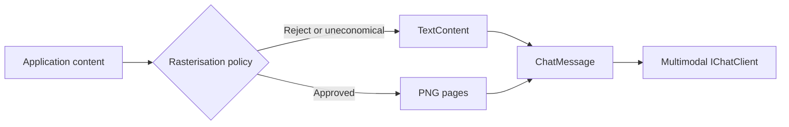

# PromptRaster

[](https://www.nuget.org/packages/PromptRaster)
[](https://dotnet.microsoft.com/download/dotnet/8.0)
[](https://github.com/kearns2000/PromptRaster/actions/workflows/build.yml)
[](LICENSE)

**Target framework:** `net8.0` · **Language:** C# 12 · **Test runner:** xUnit

PromptRaster is a .NET-native visual context encoder for Microsoft.Extensions.AI applications. It gives application developers explicit, policy-controlled ways to represent bulky, stable text as image context while preserving precise or sensitive content as normal text.

It converts selected text into compact PNG pages so multimodal language models can consume that material through vision input. The technique overlaps with prior optical-context work such as [pxpipe](https://github.com/teamchong/pxpipe); PromptRaster does not claim to invent that idea. Its product boundary is in-process .NET applications, dependency injection, and Microsoft.Extensions.AI middleware under application policy.

Token savings are not guaranteed. Whether images help depends on the model’s image token calculation, rendering dimensions, text density, prompt caching, the type of content, the model’s ability to read dense text from images, and current provider pricing. Rasterisation is lossy: it is unsuitable when the model must recover content byte for byte.

## Why PromptRaster exists

.NET applications often assemble large, relatively stable context — documentation, schemas, logs, older supporting material — inside ASP.NET Core apps, workers, Azure Functions, agents, and document-processing pipelines. Those hosts already use Microsoft.Extensions.AI and dependency injection. They rarely want a local HTTP proxy in the middle of the request path.

PromptRaster is built for that setting:

- It runs in-process with no outbound network calls of its own.
- The core renderer stays provider-neutral. Azure OpenAI and other providers are reached through `IChatClient`, not through PromptRaster.Core coupling.
- Rasterisation is opt-in and policy-driven. Callers mark eligible content; ordinary `TextContent` stays text.
- Unsupported models, failed rendering, policy rejection, and uneconomical density fall back to ordinary text unless strict mode is enabled.
- Decisions and timings are observable through `ILogger` and OpenTelemetry-compatible activities/metrics without logging prompt text or image bytes.

## How it works

```text
Application content
    -> Rasterisation policy
    -> Keep as text or render as PNG
    -> Microsoft.Extensions.AI ChatMessage
    -> Multimodal IChatClient
```



Callers should mark appropriate content for rasterisation with `RasterTextContent` (or `chatMessage.AddRasterText(...)`). Normal `TextContent` remains normal text. The middleware inspects copies of the supplied messages; it does not mutate caller-owned collections.

The core package can also be used directly through `IPromptRasterizer` when you are not building an `IChatClient` pipeline.

## Suitable content

PromptRaster is intended for bulky, stable context where approximate reading is acceptable: documentation, API or schema descriptions, historical logs, older supporting material, and large descriptive instructions that the model should understand rather than reproduce character by character.

## Unsuitable content

Do not rasterise secrets, access tokens, hashes, exact identifiers, file paths that must be reproduced exactly, financial values requiring exact recovery, structured output the model must copy byte for byte, or current user instructions where small wording changes could alter the task.

Those values should remain as text because vision encoding is lossy. A single misread character can change meaning, and heuristic “exact content” detectors are a safety aid, not a complete security control. Applications can supply their own `IRasterisationPolicy` or `IExactContentDetector` when the defaults are insufficient.

## Installation

```bash
dotnet add package PromptRaster
dotnet add package PromptRaster.MicrosoftExtensionsAI
```

## Microsoft.Extensions.AI example

Register the core services, then add PromptRaster to an `IChatClient` pipeline. Only marked content is considered for rasterisation.

```csharp
using Microsoft.Extensions.AI;
using Microsoft.Extensions.DependencyInjection;
using PromptRaster;
using PromptRaster.MicrosoftExtensionsAI;

var services = new ServiceCollection()
    .AddPromptRasterMicrosoftExtensionsAI(options =>
    {
        options.MinimumTextLength = 4_000;
        options.FallbackToText = true;
    })
    .BuildServiceProvider();

IPromptRasterizer rasterizer = services.GetRequiredService<IPromptRasterizer>();

// providerClient is your Azure OpenAI / OpenAI / other IChatClient.
IChatClient client = providerClient
    .AsBuilder()
    .UsePromptRaster(rasterizer, options =>
    {
        options.MinimumCharacterCount = 4_000;
        options.FallbackToText = true;
        options.Provider = AiProvider.AzureOpenAI;
    })
    .Build();

var message = new ChatMessage(ChatRole.User, "Summarise the attached background material.");
message.Contents.Add(new TextContent("Focus on risks and open questions."));
message.AddRasterText(backgroundDocument);

ChatResponse response = await client.GetResponseAsync([message], cancellationToken: stopToken);
```

The instruction and other `TextContent` items stay as text. `RasterTextContent` becomes one or more `DataContent` items with media type `image/png` when policy approves, or falls back to `TextContent` otherwise.

You can also build content explicitly with `IPromptRasterContentFactory` when you prefer not to use middleware:

```csharp
services.AddPromptRasterMicrosoftExtensionsAI();

var content = await promptRasterContentFactory.CreateAsync(
    "Summarise the following document.",
    documentText,
    AiProvider.OpenAI,
    cancellationToken: stopToken);

var response = await chatClient.GetResponseAsync(
    new ChatMessage(ChatRole.User, content.ToList()),
    cancellationToken: stopToken);
```

## Policy and fallback

Rasterisation is opt-in by default. In the chat pipeline, only `RasterTextContent` is eligible. The default `IRasterisationPolicy` then applies length, model-profile, structured-content, exact-content, page-limit, and density checks.

`IPromptRasterizer` always returns a text result for policy rejections. Layout or PNG rendering failures fall back to ordinary text when `PromptRasterOptions.FallbackToText` is enabled. In the chat middleware, set `StrictMode` on `PromptRasterChatClientOptions` to throw `PromptRasterException` instead of converting rejected or failed marked content to `TextContent`.

`PromptRasterMode.Always` skips structured-content and exact-content heuristics; use it only when you intentionally accept that risk.

```csharp
services.AddPromptRaster(options =>
{
    options.DetectExactContent = true;
    options.DetectStructuredContent = true;
    options.FallbackToText = true;
    options.ModelProfiles.Add(new ModelProfile
    {
        ModelId = "gpt-4.1",
        Enabled = true,
        Provider = AiProvider.OpenAI,
        MinimumCharactersPerPage = 6_000,
        EvaluationNotes = "Validate OCR quality on your own documents before production use.",
    });
});
```

## Direct core usage

```csharp
public sealed class DocumentAnalyzer(IPromptRasterizer rasterizer)
{
    public async Task AnalyzeAsync(string documentText, CancellationToken stopToken)
    {
        PromptRasterResult result = await rasterizer.RasterizeAsync(
            documentText,
            AiProvider.OpenAI,
            cancellationToken: stopToken);

        if (result.Encoding == PromptRasterEncoding.Images)
        {
            foreach (PromptRasterPage page in result.Pages)
            {
                // page.Data is PNG; page.MediaType is "image/png".
            }
        }
        else
        {
            // result.OriginalText is unchanged.
        }
    }
}
```

## Benchmarks

Published numerical savings claims are deferred until this repository contains a reproducible evaluation project.

**Methodology (results pending):**

| Field | Value |
|---|---|
| Model and provider | *Pending — record the exact model id and provider* |
| Date tested | *Pending* |
| Rendering dimensions | Default 1024×1536, font size 17, padding 48 (or the profile under test) |
| Source character count | Measure the fixture text length |
| Estimated or reported text tokens | From the provider usage API or an agreed estimator |
| Reported image tokens | From the provider usage API |
| Result quality test | Task-specific rubric (summarisation / extraction accuracy) against a text baseline |
| Prompt caching state | Explicitly on or off; do not mix |
| Benchmark command | *Pending — e.g. `dotnet run --project benchmarks/PromptRaster.Evaluations`* |

Until those fixtures land, treat any external savings figures as non-authoritative. Density thresholds in `PromptRasterOptions` are conservative heuristics, not measured guarantees.

## Related work

[pxpipe](https://github.com/teamchong/pxpipe) applies optical context compression through a TypeScript proxy and library aimed largely at AI coding workflows. PromptRaster focuses on in-process .NET applications. It is designed around Microsoft.Extensions.AI abstractions, dependency injection, and middleware. It uses explicit application policy rather than automatically rewriting an entire request. It aims to support Azure OpenAI and other providers exposed through `IChatClient` without coupling the core renderer to a provider. Both approaches are lossy and unsuitable for content requiring byte-exact recovery.

PromptRaster is not “pxpipe for .NET”. The shared idea is representing bulky text as images for multimodal models; the product boundary is policy-driven encoding inside .NET application hosts.

## Status and roadmap

### Implemented

- Provider-neutral core renderer (`PromptRaster` package) with SkiaSharp PNG output
- Conservative automatic decisioning via `IRasterisationPolicy`, content classification, and exact-content heuristics
- Model profiles (`ModelProfile` / `IModelProfileProvider`) with unknown-model fallback to text
- Optional page cache (`IPromptRasterCache`) with stable keys; no cache of secrets by default
- Structured logging plus Activity/Meter instrumentation without prompt or image payloads
- Microsoft.Extensions.AI content factory (`IPromptRasterContentFactory`)
- `DelegatingChatClient` middleware (`UsePromptRaster`) with `RasterTextContent` opt-in marking
- Fallback-to-text behaviour and optional strict mode on the chat middleware
- Deterministic PNG bytes for identical text and render settings (covered by tests)

### Roadmap

- `PromptRaster.Evaluations` benchmark project with reproducible fixtures and published results
- Richer estimated image-token helpers per model family (still without hardcoding transient prices into the core)
- Additional built-in model profiles contributed from evaluation notes
- Optional application-supplied exact-content classifiers beyond the default heuristics

Not in scope for this library’s positioning: a standalone reverse proxy, a dashboard, or an automatic conversation-history compressor.

## Architecture

```text
src/PromptRaster/                         # Core (provider-neutral; no MEAI reference)
src/PromptRaster.MicrosoftExtensionsAI/   # Content factory + chat middleware
tests/PromptRaster.Tests/
tests/PromptRaster.MicrosoftExtensionsAI.Tests/
samples/PromptRaster.ConsoleSample/
```

The NuGet package id for the core remains `PromptRaster` (conceptually the Core package). It must not reference OpenAI, Azure OpenAI, Anthropic, or Microsoft.Extensions.AI.

## Building from source

```bash
dotnet restore
dotnet build --configuration Release
dotnet test --configuration Release --no-build
dotnet pack --configuration Release --no-build
```

Run the sample (writes PNGs locally; no API key required):

```bash
dotnet run --project samples/PromptRaster.ConsoleSample
```

See [PUBLISHING.md](PUBLISHING.md) for NuGet release steps and [CONTRIBUTING.md](CONTRIBUTING.md) for contribution guidance.

## License

MIT
